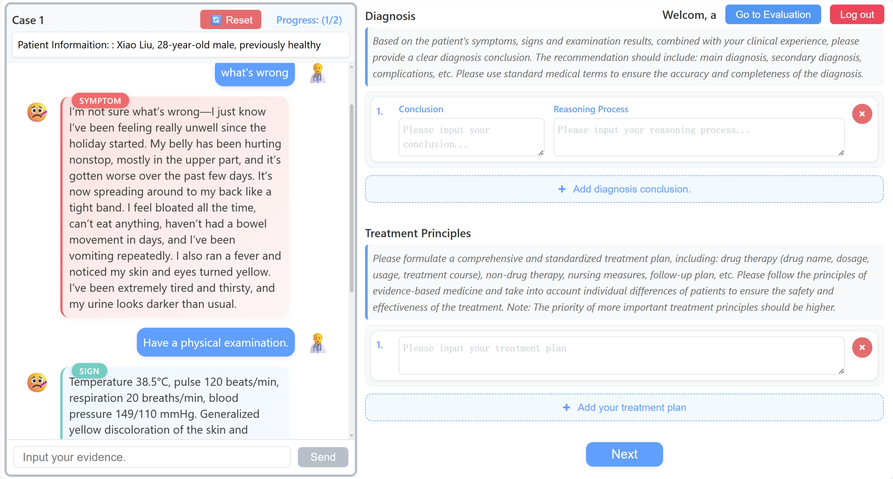
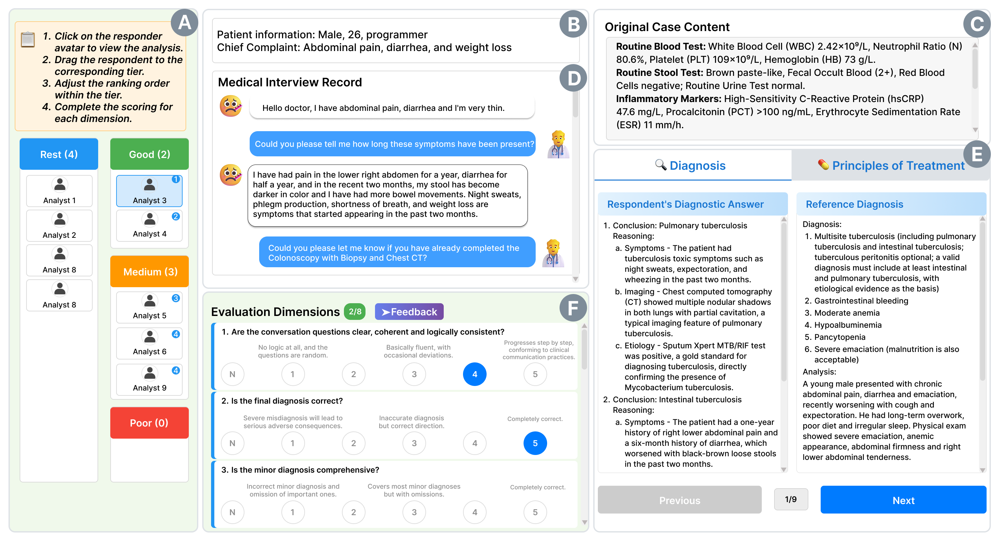

## Overview

This medical diagnostic assessment and testing platform is developed for our CHI 26 paper [*"Do I Trust the AI?" Towards Trustworthy AI-Assisted Diagnosis: Understanding User Perception in LLM-Supported Clinical Reasoning*](https://arxiv.org/abs/2601.19540), with the following modes:

1. **Analysis Mode**: Doctors can view patient information and diagnose through conversations with an AI-simulated patient.
2. **Evaluation Mode**: Examine responses of pre-collected analysts (LLMs and doctors with different experience levels), perform ranking and scoring. Different from the paper, we have real-named the respondents for examination convenience.
3. **Mixed Mode**: Run both analysis and evaluation modes simultaneously, supporting flexible switching between the two modes.

Please note that in our open-source version, we provide only the original case files and corresponding response records for **Case 8** and **Case 9** presented in the article, along with response records from different LLMs and physicians with varying levels of clinical experience.

### Analysis Mode



### Evaluation Mode



## Features

- **Multi-Analysts Comparison**：Curated clinical cases are analyzed by multiple LLMs (Deepseek-V3, GPT-4, Gemini, etc.) and clinicians across different experience levels.
- **Customizable Evaluation**：Supports drag-and-drop ranking and pre-defined dimensional scoring for clinicians’ diagnostic conclusions and treatment plans.
- **Flexible Extension**：Allows users to add new medical cases to enable scalable assessment.

---

## Environment Setup

### Prerequisites

- Python 3.9+
- Node.js 16+
- npm 8+

### Backend Setup

```bash
# Enter backend directory
cd backend

# Create conda virtual environment named "diagnosis_testing" (Python版本可根据项目需求调整，例如python=3.9/3.10)
conda create -n diagnosis_testing python=3.9 -y

# Activate the conda environment (跨Windows/MacOS/Linux通用, Windows终端需使用Anaconda Prompt或配置conda环境变量)
conda activate diagnosis_testing

# Install dependencies from requirements.txt
pip install -r requirements.txt
```

### Frontend Setup

```bash
# Enter frontend directory
cd frontend

# Install dependencies
npm install
```

### Model Configuration and API Key

**Configuration Method:**

#### Using `.env` file in project root (Recommended)

**Example `.env` file (`root/.env`):**

```bash
# OpenAI API Configuration
OPENAI_API_KEY=sk-your_api_key_here
OPENAI_BASE_URL=https://dashscope.aliyuncs.com/compatible-mode/v1
OPENAI_MODEL=qwen-plus

# Flask Configuration
FLASK_ENV=production
FLASK_DEBUG=0

# Security Configuration
SECRET_KEY=your-secret-key-here

# CORS Configuration (optional)
CORS_ORIGINS=http://localhost:8080,http://localhost:8081
```

## Running the Project

### Method 1: Using Batch Scripts (Recommended for Windows Users)

Use the `.bat` scripts located in the project root directory. Run the corresponding `.bat` file in **Command Prompt (cmd)** to start the desired mode.

Note that a **Conda environment** is required.

1. Mixed Mode - `start_mixed.bat`
2. Analysis Mode Only - `start_analysis.bat`
3. Evaluation Mode Only - `start_evaluation.bat`

### Method 2: Manual Startup (Cross-platform)

#### Mixed Mode

```bash
# Terminal 1: Start backend
cd backend
python run_all.py

# Terminal 2: Start frontend
cd frontend
npm run mixed
```

#### Analysis Mode Only

```bash
# Terminal 1: Start backend
cd backend
python run.py

# Terminal 2: Start frontend
cd frontend
npm run analysis
```

#### Evaluation Mode Only

```bash
# Terminal 1: Start backend
cd backend
python run_evaluation.py

# Terminal 2: Start frontend
cd frontend
npm run evaluation
```

---
## Systemta Flow and File Structure

### Core Data Directory Structure

```
backend/
├── conversations/          # Medical case data storage directory
│   ├── case8/            # Example case
│   │   ├── case8.json    # Original case file
│   │   ├── Expert.json    # Senior physician's response
│   │   ├── Middle.json    # Mid-level physician's response 
│   │   ├── Young.json     # Junior physician's response 
│   │   ├── GPT-4.json     # GPT-4's response
│   │   ├── Deepseek-V3.json  # Deepseek-V3's response
│   │   ├── Gemini2.5pro.json # Gemini 2.5 Pro's response
│   │   ├── Qwen3-235b-a22b-Thinking.json  # Qwen's response
│   │   ├── Qwq-32b.json   # Qwq-32b's response
│   │   └── {username}.json # User's response (generated when running analysis mode)
│   ├── case9/            # Case 9 (same structure as above)
│   └── ...                # Other cases
├── evaluation_config.py    # Evaluation configuration file
├── config.py              # Analysis mode configuration file
├── run_all.py             # Startup script (starts both analysis and evaluation services)
├── run.py                 # Analysis mode backend (port 5000)
├── run_evaluation.py      # Evaluation mode backend (port 5001)
└── requirements.txt       # Python dependencies
```

### Case File Format

#### Original Case File (case.json)

```json
{
  "prompt1": "System prompt for AI role-playing (patient behavior instructions)...",
  "prompt2": "Patient case background and history...",
  "prompt3": {
    "Physical Examination": "Doctor's physical examination findings...",
    "Blood Tests": {"TBIL": "value", "ALT": "value", ...},
    "Ultrasound": "Imaging findings...",
    "Gastroscopy": "Endoscopy results...",
    "Serum Amylase (AMY)": "lab value...",
    "Urine Amylase (UAMY)": "lab value...",
    "Abdominal CT": "CT scan findings..."
  },
  "personal_message": "Patient basic information (name, age, gender, medical history)...",
  "main_suit": "Chief complaint...",
  "Reference_Diagnostic": "Reference diagnosis and reasoning...",
  "Reference_Treatment": "Reference treatment plan and rationale..."
}
```

#### Evaluator Response File (.json)

**Evaluators include:**

- `Expert.json` - Senior clinician (10+ years of experience)
- `Middle.json` - Mid-level clinician (5-10 years of experience)
- `Young.json` - Junior clinician (0-5 years of experience)
- `GPT-4.json`, `Deepseek-V3.json`, `Gemini2.5pro.json`, etc. - LLM responses

```json
{
  "conversation": [
    {
      "role": "user",
      "content": "Doctor's question...",
      "timestamp": "2025-08-23T08:54:48.068Z"
    },
    {
      "role": "assistant",
      "content": "Patient's response...",
      "timestamp": "2025-08-23T08:54:50.068Z"
    }
  ],
  "Diagnosis": "Evaluator's diagnostic conclusion with reasoning...",
  "Treatment": "Evaluator's treatment plan with detailed measures..."
}
```

#### User Response File (.json)

Generated automatically when users save their responses after running analysis mode. Format is the same as evaluator response files above.

### Data Flow

1. **Analysis Mode Flow**:

   - Load `conversations/case{X}/case{X}.json` as initial patient data
   - Doctor interacts with AI patient through conversation (LLM-driven)
   - Doctor inputs diagnosis and treatment plan
   - System saves response as `conversations/case{X}/{username}.json`
2. **Evaluation Mode Flow**:

   - Load user's response from analysis mode (`{username}.json`)
   - Load all evaluators' responses (LLM and doctor data)
   - Users can drag-and-drop rank, score, and evaluate each evaluator's response
   - Evaluation results are stored locally or in the backend database
3. **Mixed Mode Flow**:

   - Run analysis and evaluation services simultaneously
   - User completes their response in analysis mode
   - Automatically switches to evaluation mode to assess their response
   - Support free switching between the two modes

### Adding New Cases

1. Create a new folder `case{X}` in `backend/conversations/`
2. Create `case{X}.json` in that folder with patient information and reference answers
3. **Optional**: Add evaluator response files (`Expert.json`, `GPT-4.json`, etc.)
4. New cases will automatically appear when users run analysis mode

> **Note**: If you only add `case{X}.json` without evaluator data, users will only see their own response in evaluation mode without being able to compare with other evaluators.

---
